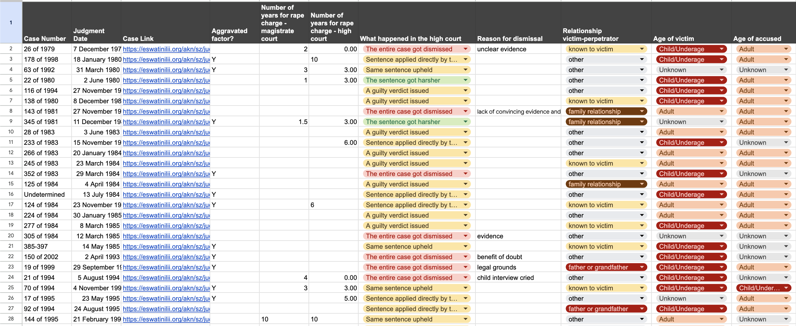
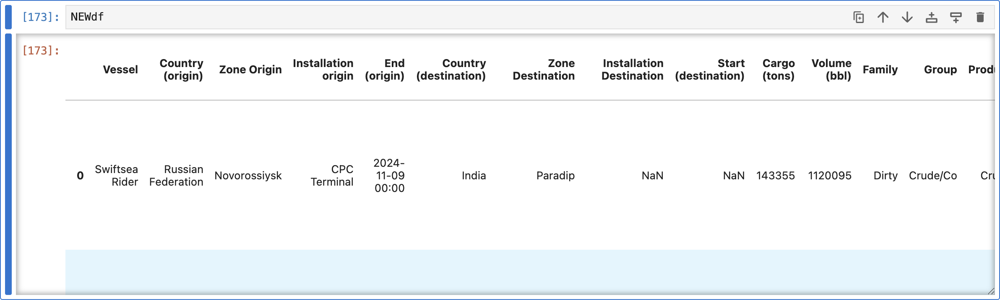
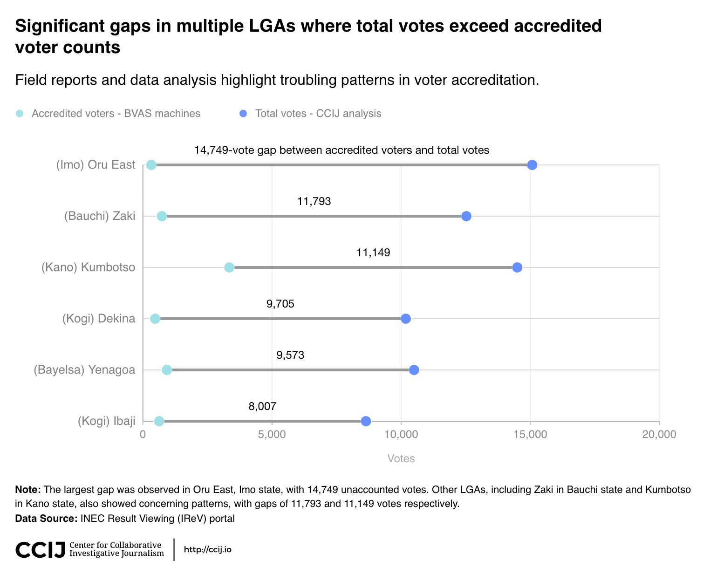
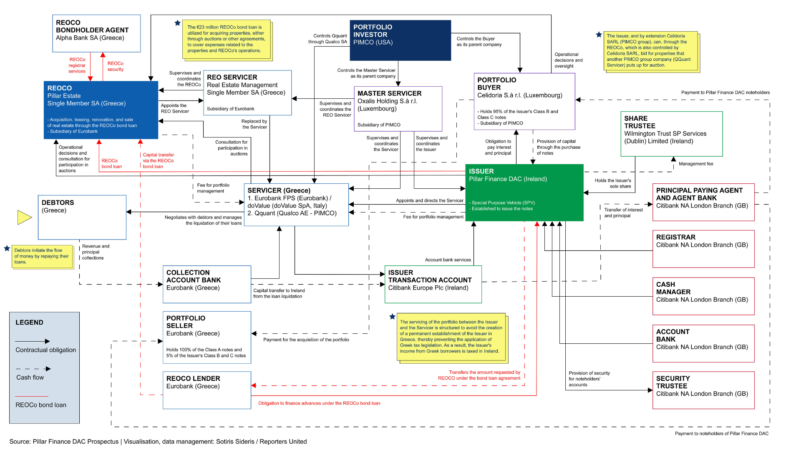

# Code samples

This repository contains selected code and data visualizations developed by Sotiris Sideris for cross-border investigations.

The code and methodology are provided here to support transparency, reproducibility and knowledge sharing within the data and investigative journalism community.

Questions about the code in this repo? Email sotirisideris@gmail.com

---

## Investigations

### 1. Court record analysis — Gender-based violence cases in Eswatini

This [project](https://veza.news/article/2024/10/24/without-justice-how-eswatinis-system-is-failing-victims-of-gender-based-violence/) involved collecting and analyzing court records to examine patterns in gender-based violence prosecutions.

**Code**

`notebooks/eswatini_gbv_case_pipeline.ipynb`

**Pipeline overview**

1. Scrape court records
2. Extract case metadata
3. Clean and structure case data
4. Use NLP classification to identify gender-based violence cases
5. Human verification of model outputs

**Key techniques**

- web scraping
- structured text extraction
- machine-assisted classification

---

### 2. Shipping database extraction — Vessel management networks

This notebook demonstrates a scraper used to collect [vessel ownership and management records](https://www.investigate-europe.eu/posts/european-ships-bolster-russian-fossil-fuel-trade-despite-looming-eu-sanctions) from Equasis.

**Code**

`notebooks/equasis_vessel_management_scraper.ipynb`

**Pipeline overview**

1. Scraping vessel management databases
2. Structured data extraction
3. Network-ready output

**Key techniques**

- Selenium automation
- structured scraping
- maritime data normalization

---

### 3. Election transparency analysis — Nigeria 2023

This [investigation](https://veza.news/article/2025/03/31/broken-promises-of-transparency-a-deep-dive-into-nigerias-2023-election-data/) examines discrepancies between official election results and underlying documents published through Nigeria's election transparency portal.

The project involved:

- scraping election result documents
- OCR extraction of vote tallies
- structured data comparison
- interactive visualization of discrepancies

**Code**

- `observable`
- [Observable interactive visualizations](https://observablehq.com/d/bb1429f00e502067)

**Key techniques**

- OCR document extraction
- structured vote comparison
- anomaly detection
- interactive dataviz

---

### 4. Property auction monitoring — Greek electronic auctions

[This project](https://www.reportersunited.gr/en/14444/minotaur-captured-eurobank/) scrapes and structures auction listings from [eauction.gr](https://www.eauction.gr), Greece's official electronic auction platform, to support monitoring of distressed-property auctions.

The project involved:

- scraping multi-page auction listing indexes
- visiting each auction detail page to extract structured fields (dates, starting bid, total debt, region, debtors, attached PDFs)
- combining and deduplicating data across scraping batches
- exporting clean datasets for further analysis and OpenRefine reconciliation

**Code**

`notebooks/greek_auctions_scraper.ipynb`

**Pipeline overview**

1. Scrape listing pages → collect auction URLs and regions
2. Combine listing CSVs; extract clean URLs with regex
3. Visit detail pages → extract auction metadata, debtor info, PDF attachments
4. Merge all batches into a master dataset

**Key techniques**

- Selenium browser automation
- BeautifulSoup structured HTML parsing
- regex extraction
- pandas data wrangling and deduplication